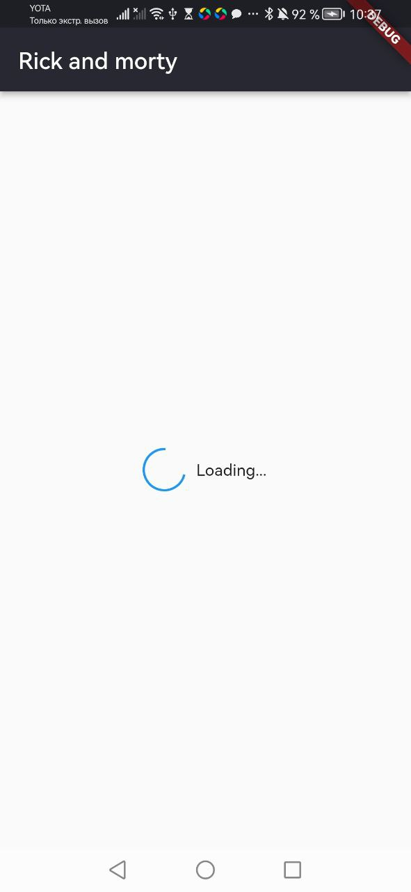
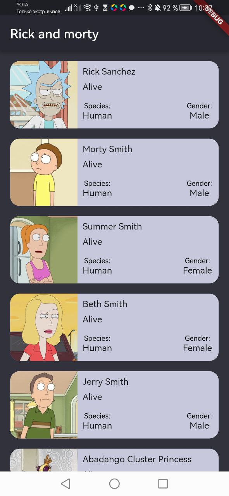
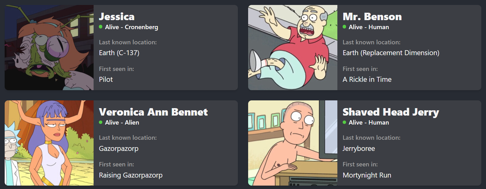

# rickandmorty

Introducing an advanced app that uses the Flutter framework and an API to bring the world of Rick and Morty characters to your smartphone. With seamless integration and the bloc architecture, this app provides real-time, comprehensive information about characters, including names, species, origins, and more. Experience the captivating world of Rick and Morty with this immersive and user-friendly app, perfect for fans and newcomers alike.

# UI

| Getting data (state - loading) | Got data (state - loaded) | Error (state - error) |
| :----------------------------: | :-----------------------: | :-------------------: |
|         |     |  |

# api

Get all characters - https://rickandmortyapi.com/api/character

```json
{
  "info": {
    "count": 826,

    "pages": 42,

    "next": "https://rickandmortyapi.com/api/character/?page=2",

    "prev": null
  },

  "results": [
    {
      "id": 1,

      "name": "Rick Sanchez",

      "status": "Alive",

      "species": "Human",

      "type": "",

      "gender": "Male",

      "origin": {
        "name": "Earth",

        "url": "https://rickandmortyapi.com/api/location/1"
      },

      "location": {
        "name": "Earth",

        "url": "https://rickandmortyapi.com/api/location/20"
      },

      "image": "https://rickandmortyapi.com/api/character/avatar/1.jpeg",

      "episode": [
        "https://rickandmortyapi.com/api/episode/1",

        "https://rickandmortyapi.com/api/episode/2" // ...
      ],

      "url": "https://rickandmortyapi.com/api/character/1",

      "created": "2017-11-04T18:48:46.250Z"
    } // ...
  ]
}
```

